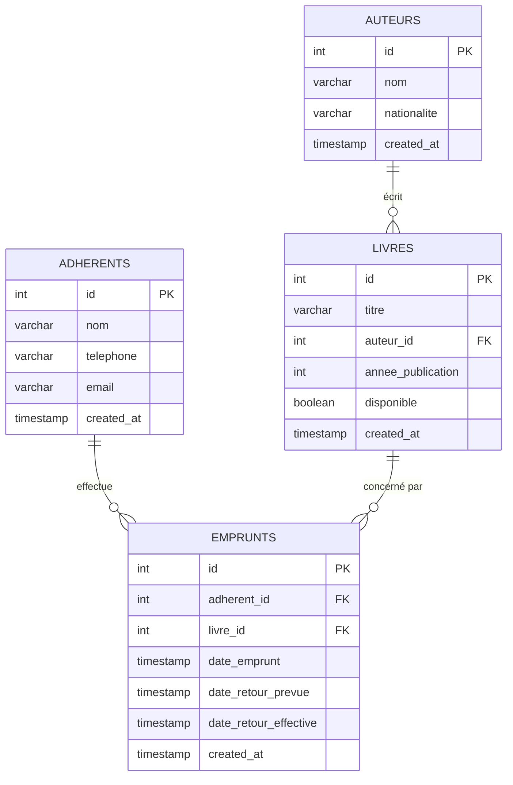

# BiblioQuartier — Gestion d'une bibliothèque de quartier

Projet pratique **Akieni Academy — Cohorte 2 — Semaines 14 & 15** (Module 3 : Backend Node.js, SQL & Express).

Application complète de gestion d'une bibliothèque : catalogue de livres, auteurs, adhérents, emprunts avec détection des retards, et tableau de bord statistique. Backend **Express + PostgreSQL**, frontend **HTML/CSS/JS** (fetch API).

## Fonctionnalités

- **Auteurs** : CRUD complet (nom, nationalité)
- **Adhérents** : CRUD complet (nom, contact) + historique de ses emprunts (en cours et passés)
- **Livres** : CRUD, statut de disponibilité visible, recherche par titre ou auteur, pagination, filtre par disponibilité
- **Emprunts** : création (refusée si livre déjà emprunté), retour (le livre redevient disponible), listes en cours / en retard
- **Tableau de bord** : totaux (livres, adhérents, en cours, en retard), livre le plus emprunté, adhérent le plus actif
- **Bonus** : notifications toast, export CSV des emprunts en retard

## Prérequis

- Node.js 18+
- PostgreSQL 14+ (serveur démarré)

## Installation

```bash
# 1. Cloner le dépôt
git clone <url-du-depot>
cd akieni_academy

# 2. Installer les dépendances
npm install

# 3. Configurer l'environnement
copy .env.example .env
# puis ajuster DB_USER / DB_PASSWORD si besoin
```

```bash
# 4. Créer les tables (le script crée aussi la base `bibliotheque`)
psql -U postgres -d postgres -f db/schema.sql

# 5. Charger les données de test (7 auteurs, 8 adhérents, 10 livres, 8 emprunts)
psql -U postgres -d bibliotheque -f db/seed.sql

# 6. Démarrer le serveur (API + frontend statique)
npm start
```

Ouvrir ensuite **http://localhost:3000**.

> Variables attendues dans `.env` (voir `.env.example`) : `DB_HOST`, `DB_PORT`, `DB_USER`, `DB_PASSWORD`, `DB_NAME`, `PORT`.

## Structure du projet

```
├── backend/
│   ├── server.js              # point d'entrée Express
│   ├── db.js                  # pool de connexion PostgreSQL
│   ├── controllers/           # logique métier (auteurs, adherents, livres, emprunts, stats)
│   ├── routes/                # définitions des routes API
│   └── middlewares/           # logger, validation, gestion d'erreurs centrale
├── frontend/
│   ├── index.html             # SPA : Dashboard, Livres, Auteurs, Adhérents, Emprunts
│   ├── css/style.css          # design system (sidebar, panels, badges, tables, modales)
│   └── js/
│       ├── app.js             # navigation + lecture API (recherche, pagination, CSV)
│       ├── forms.js           # formulaires CRUD + emprunts/retours + erreurs
│       └── toast.js           # notifications visuelles
├── db/
│   ├── schema.sql             # recrée la base depuis zéro
│   └── seed.sql               # données de test
├── .env.example
└── package.json
```

## API — endpoints

| Méthode | Route | Description |
|---|---|---|
| GET | `/api/health` | État du serveur + connexion DB |
| GET | `/api/stats` | Totaux, livre le plus emprunté, adhérent le plus actif |
| GET | `/api/auteurs` | Liste des auteurs |
| GET | `/api/auteurs/:id` | Un auteur |
| POST | `/api/auteurs` | Créer un auteur `{ nom, nationalite }` |
| PUT | `/api/auteurs/:id` | Modifier un auteur |
| DELETE | `/api/auteurs/:id` | Supprimer un auteur |
| GET | `/api/adherents` | Liste des adhérents |
| GET | `/api/adherents/:id` | Un adhérent |
| POST | `/api/adherents` | Créer un adhérent `{ nom, telephone, email }` |
| PUT | `/api/adherents/:id` | Modifier un adhérent |
| DELETE | `/api/adherents/:id` | Supprimer un adhérent |
| GET | `/api/adherents/:id/emprunts` | Historique des emprunts d'un adhérent |
| GET | `/api/livres?q=&auteur=&disponible=&page=&limit=` | Catalogue (recherche, filtre, pagination) |
| GET | `/api/livres/:id` | Un livre (+ nom de l'auteur) |
| POST | `/api/livres` | Créer un livre `{ titre, auteur_id, annee_publication }` |
| PUT | `/api/livres/:id` | Modifier un livre |
| DELETE | `/api/livres/:id` | Supprimer un livre |
| GET | `/api/emprunts?statut=en_cours\|en_retard` | Emprunts (tous / en cours / en retard) |
| POST | `/api/emprunts` | Créer un emprunt `{ adherent_id, livre_id, date_retour_prevue }` |
| PUT | `/api/emprunts/:id/retour` | Enregistrer le retour d'un livre |

Toutes les erreurs sont renvoyées au format `{ "error": "<message>" }` avec le code HTTP adapté (400 validation/métier, 404 introuvable, 500 serveur).

## Modélisation des données

### Choix de modélisation

- **4 tables** : `auteurs`, `adherents`, `livres`, `emprunts`. Pas de table d'association : un livre n'a qu'un seul auteur et un emprunt lie exactement un adhérent à un livre.
- `livres.auteur_id` → `auteurs.id` (`ON DELETE CASCADE`) : supprimer un auteur retire ses livres.
- `emprunts.adherent_id` / `emprunts.livre_id` (`ON DELETE CASCADE`) : l'historique suit la suppression d'un adhérent ou d'un livre.
- `livres.disponible` (booléen) : dénormalisation volontaire pour afficher le statut sans jointure ; synchronisé par le backend à la création d'un emprunt (`FALSE`) et au retour (`TRUE`).
- Cycle de vie d'un emprunt : `date_retour_effective IS NULL` = en cours ; `date_retour_effective IS NULL AND date_retour_prevue < NOW()` = en retard.
- Index sur `livres(titre)`, `livres(auteur_id)`, `livres(disponible)` et les clés étrangères pour la recherche et les jointures.

### Diagramme entité-relation



### Règles métier implémentées

1. Un emprunt est refusé (400) si le livre est déjà marqué `emprunté`.
2. À la création d'un emprunt, le livre passe automatiquement à `emprunté`.
3. Au retour, `date_retour_effective` est posée et le livre redevient `disponible` ; un second retour est refusé (400).
4. Retard = retour prévu dépassé et livre non rendu.
5. Statistiques calculées en SQL : totaux, `COUNT + GROUP BY + ORDER BY + LIMIT 1` pour le livre le plus emprunté et l'adhérent le plus actif.
6. Requêtes SQL paramétrées (`$1, $2…`) contre les injections ; validation des champs côté middleware + côté interface.

## Améliorations futures

- Comptes bibliothécaires avec authentification JWT + routes protégées
- Réservation d'un livre déjà emprunté (file d'attente)
- Pagination côté adhérents/emprunts
