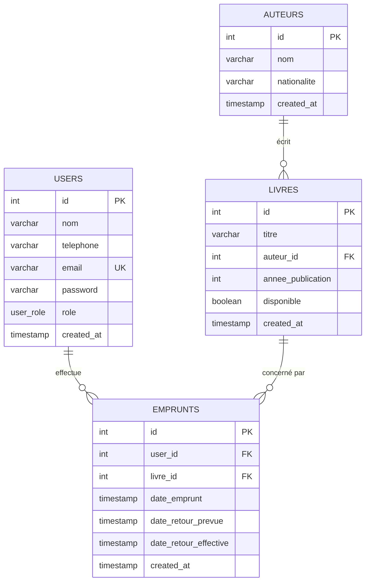

# BiblioQuartier — Gestion d'une bibliothèque de quartier

Projet pratique **Akieni Academy — Cohorte 2 — Semaines 14 & 15** (Module 3 : Backend Node.js, SQL & Express).

Application complète de gestion d'une bibliothèque : catalogue de livres, auteurs, utilisateurs (adhérents / bibliothécaires / administrateurs), emprunts avec détection des retards, tableau de bord statistique, et **authentification JWT**. Backend **Express + PostgreSQL**, frontend **HTML/CSS/JS** (fetch API).

## Fonctionnalités

- **Authentification JWT** : register, login, profil. Trois rôles avec accès différent (`adherent`, `bibliothecaire`, `superadmin`)
- **Utilisateurs** : gestion des comptes (superadmin), historique d'emprunts d'un utilisateur
- **Auteurs** : CRUD complet (nom, nationalité) — écriture réservée aux bibliothécaires et superadmin
- **Livres** : CRUD, statut de disponibilité, recherche par titre/auteur, pagination, filtre — écriture réservée aux bibliothécaires et superadmin
- **Emprunts** : création (refusée si livre déjà emprunté ; un adhérent ne peut emprunter que pour lui-même), retour, listes en cours / en retard
- **Tableau de bord** : totaux (livres, adhérents, en cours, en retard), livre le plus emprunté, adhérent le plus actif
- **Bonus** : notifications toast, export CSV des emprunts en retard

## Prérequis

- Node.js 18+
- PostgreSQL 14+ (serveur démarré)

## Installation

```bash
# 1. Cloner le dépôt
git clone <url-du-depot>
cd akieni_academy

# 2. Installer les dépendances
npm install

# 3. Configurer l'environnement
copy .env.example .env
# puis ajuster DB_USER / DB_PASSWORD si besoin
# IMPORTANT : changer JWT_SECRET pour un secret de production
```

```bash
# 4. Créer les tables (le script crée aussi la base `bibliotheque`)
psql -U postgres -d postgres -f db/schema.sql

# 5. Charger les données de test (10 utilisateurs, 7 auteurs, 10 livres, 8 emprunts)
psql -U postgres -d bibliotheque -f db/seed.sql

# 6. Démarrer le serveur (API + frontend statique)
npm start
```

Ouvrir ensuite **http://localhost:3000**.

> Variables attendues dans `.env` (voir `.env.example`) : `DB_HOST`, `DB_PORT`, `DB_USER`, `DB_PASSWORD`, `DB_NAME`, `PORT`, `JWT_SECRET`, `JWT_EXPIRES_IN`.

## Comptes de démo

| Rôle | Email | Mot de passe |
|---|---|---|
| superadmin | `admin@biblio.fr` | `superadmin123` |
| bibliothecaire | `biblio@biblio.fr` | `biblio123` |
| adherent | `aminata.diallo@email.com` | `adherent123` |

## Structure du projet

```
├── backend/
│   ├── server.js              # point d'entrée Express
│   ├── db.js                  # pool de connexion PostgreSQL
│   ├── controllers/
│   │   ├── auth.controller.js   # register, login, me
│   │   ├── users.controller.js  # gestion des utilisateurs
│   │   ├── auteurs.controller.js
│   │   ├── livres.controller.js
│   │   ├── emprunts.controller.js
│   │   └── stats.controller.js
│   ├── routes/
│   │   ├── auth.routes.js       # POST /register, POST /login, GET /me
│   │   ├── users.routes.js      # CRUD utilisateurs (protégé)
│   │   ├── auteurs.routes.js
│   │   ├── livres.routes.js
│   │   ├── emprunts.routes.js
│   │   └── stats.routes.js
│   ├── middlewares/
│   │   ├── auth.js              # auth JWT + requireRole
│   │   ├── validation.js        # validation des champs
│   │   ├── logger.js            # logs des requêtes
│   │   └── errorHandler.js      # gestion centralisée des erreurs
│   └── utils/
│       └── response.js          # helpers { status, message, data }
├── frontend/
│   ├── index.html             # SPA : login, Dashboard, Livres, Auteurs, Utilisateurs, Emprunts
│   ├── css/style.css          # design system (sidebar, panels, badges, tables, modales, login)
│   └── js/
│       ├── app.js             # auth + navigation + lecture API
│       ├── forms.js           # formulaires CRUD
│       └── toast.js           # notifications visuelles
├── db/
│   ├── schema.sql             # recrée la base depuis zéro
│   └── seed.sql               # données de test (users + hashes bcrypt)
├── .env.example
└── package.json
```

## API — endpoints

### Authentification (public)

| Méthode | Route | Description |
|---|---|---|
| POST | `/api/auth/register` | Créer un compte (rôle `adherent` par défaut) `{ nom, telephone, email, password }` |
| POST | `/api/auth/login` | Connexion `{ email, password }` → retourne `{ user, token }` |
| GET | `/api/auth/me` | Profil de l'utilisateur connecté (requiert `Authorization: Bearer <token>`) |

### Utilisateurs (protégé)

| Méthode | Rôle requis | Route | Description |
|---|---|---|---|
| GET | bibliothecaire, superadmin | `/api/users?role=&q=&page=&limit=` | Liste des utilisateurs (filtrable par rôle) |
| GET | tous authentifiés | `/api/users/:id` | Détail d'un utilisateur |
| GET | tous authentifiés | `/api/users/:id/emprunts` | Historique des emprunts d'un utilisateur (un adhérent ne voit que les siens) |
| POST | bibliothecaire, superadmin | `/api/users` | Créer un utilisateur `{ nom, email, password, role }` |
| PUT | superadmin (ou soi-même) | `/api/users/:id` | Modifier un utilisateur (nom, telephone, email, password, role) |
| DELETE | superadmin | `/api/users/:id` | Supprimer un utilisateur |

### Auteurs (protégé — écriture : bibliothecaire / superadmin)

| Méthode | Route | Description |
|---|---|---|
| GET | `/api/auteurs` | Liste des auteurs |
| GET | `/api/auteurs/:id` | Un auteur |
| POST | `/api/auteurs` | Créer un auteur `{ nom, nationalite }` |
| PUT | `/api/auteurs/:id` | Modifier un auteur |
| DELETE | `/api/auteurs/:id` | Supprimer un auteur |

### Livres (protégé — écriture : bibliothecaire / superadmin)

| Méthode | Route | Description |
|---|---|---|
| GET | `/api/livres?q=&auteur=&disponible=&page=&limit=` | Catalogue (recherche, filtre, pagination) |
| GET | `/api/livres/:id` | Un livre (+ nom de l'auteur) |
| POST | `/api/livres` | Créer un livre `{ titre, auteur_id, annee_publication }` |
| PUT | `/api/livres/:id` | Modifier un livre |
| DELETE | `/api/livres/:id` | Supprimer un livre |

### Emprunts (protégé)

| Méthode | Route | Description |
|---|---|---|
| GET | `/api/emprunts?statut=en_cours\|en_retard` | Emprunts (un adhérent ne voit que les siens) |
| POST | `/api/emprunts` | Créer un emprunt `{ user_id, livre_id, date_retour_prevue }` |
| PUT | `/api/emprunts/:id/retour` | Enregistrer le retour d'un livre |

### Statistiques & santé (protégé / public)

| Méthode | Route | Description |
|---|---|---|
| GET | `/api/health` | État du serveur + connexion DB (public) |
| GET | `/api/stats` | Totaux, livre le plus emprunté, adhérent le plus actif (requiert auth) |

### Format des réponses

Toutes les réponses API utilisent le format :

```json
{
  "status": "success",
  "message": "Description du résultat",
  "data": { ... }
}
```

En cas d'erreur :

```json
{
  "status": "error",
  "message": "Description de l'erreur",
  "data": null
}
```

Codes HTTP utilisés : **200** succès, **201** création, **400** validation/métier, **401** non authentifié, **403** droits insuffisants, **404** introuvable, **500** serveur.

## Modélisation des données

### Choix de modélisation

- **4 tables** : `users`, `auteurs`, `livres`, `emprunts`. Pas de table d'association : un livre n'a qu'un seul auteur et un emprunt lie exactement un utilisateur à un livre.
- `users` contient tous les comptes avec un champ `role` enum (`adherent`, `bibliothecaire`, `superadmin`). Les adhérents ne sont plus une table séparée mais un rôle de la table `users`.
- `livres.auteur_id` → `auteurs.id` (`ON DELETE CASCADE`) : supprimer un auteur retire ses livres.
- `emprunts.user_id` / `emprunts.livre_id` (`ON DELETE CASCADE`) : l'historique suit la suppression d'un utilisateur ou d'un livre.
- `livres.disponible` (booléen) : dénormalisation volontaire pour afficher le statut sans jointure ; synchronisé par le backend à la création d'un emprunt (`FALSE`) et au retour (`TRUE`).
- Cycle de vie d'un emprunt : `date_retour_effective IS NULL` = en cours ; `date_retour_effective IS NULL AND date_retour_prevue < NOW()` = en retard.
- Index sur `livres(titre)`, `livres(auteur_id)`, `livres(disponible)`, `users(email)` et les clés étrangères.

### Diagramme entité-relation



### Rôles et permissions

| Action | adherent | bibliothecaire | superadmin |
|---|:---:|:---:|:---:|
| Voir catalogue (livres, auteurs) | ✅ | ✅ | ✅ |
| Consulter son historique d'emprunts | ✅ | ✅ | ✅ |
| Créer un emprunt (pour soi-même) | ✅ | ✅ | ✅ |
| Retourner un emprunt (le sien) | ✅ | ✅ | ✅ |
| CRUD auteurs | ❌ | ✅ | ✅ |
| CRUD livres | ❌ | ✅ | ✅ |
| Créer/modifier adhérents | ❌ | ✅ | ✅ |
| Lister tous les emprunts | ❌ | ✅ | ✅ |
| Gérer les comptes (rôles) | ❌ | ❌ | ✅ |
| Supprimer un utilisateur | ❌ | ❌ | ✅ |

### Règles métier implémentées

1. Un emprunt est refusé (400) si le livre est déjà marqué `emprunté`.
2. Un adhérent ne peut emprunter que pour lui-même.
3. À la création d'un emprunt, le livre passe automatiquement à `emprunté`.
4. Au retour, `date_retour_effective` est posée et le livre redevient `disponible` ; un second retour est refusé (400).
5. Retard = retour prévu dépassé et livre non rendu.
6. Statistiques calculées en SQL : totaux, `COUNT + GROUP BY + ORDER BY + LIMIT 1` pour le livre le plus emprunté et l'adhérent le plus actif.
7. Requêtes SQL paramétrées (`$1, $2…`) contre les injections ; validation des champs côté middleware + côté interface.
8. Authentification JWT avec token transmis en header `Authorization: Bearer <token>`, vérifié à chaque requête protégée.

## Déploiement (Dokploy)

Le projet se déploie en deux applications Dokploy (frontend nginx + backend
Express) plus un service PostgreSQL géré par Dokploy — voir
[deploy.md](deploy.md) pour la procédure complète, les variables
d'environnement et le dépannage.

## Améliorations futures

- Réservation d'un livre déjà emprunté (file d'attente)
- Pagination côté adhérents/emprunts